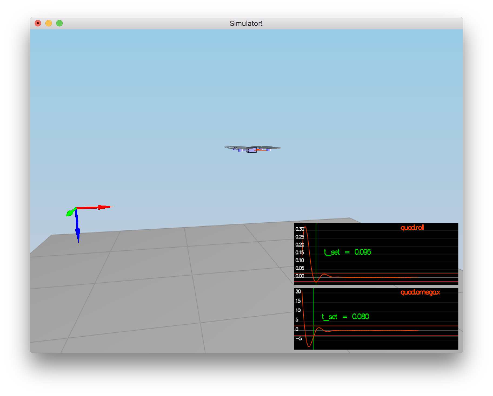
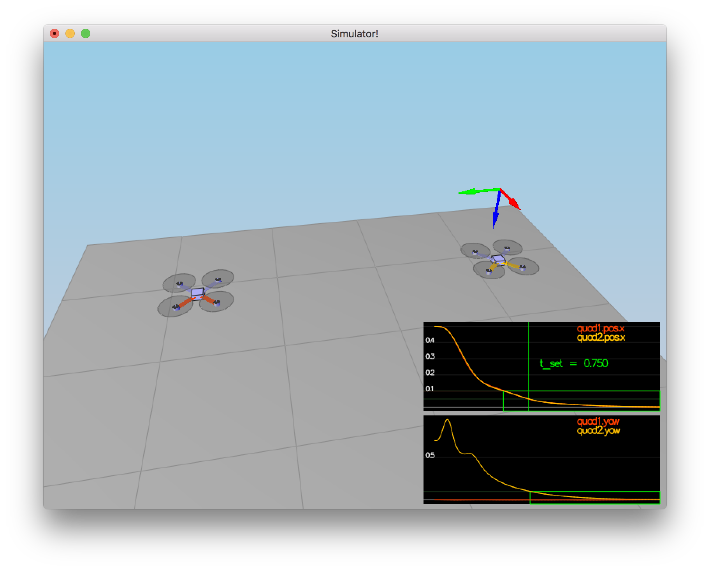
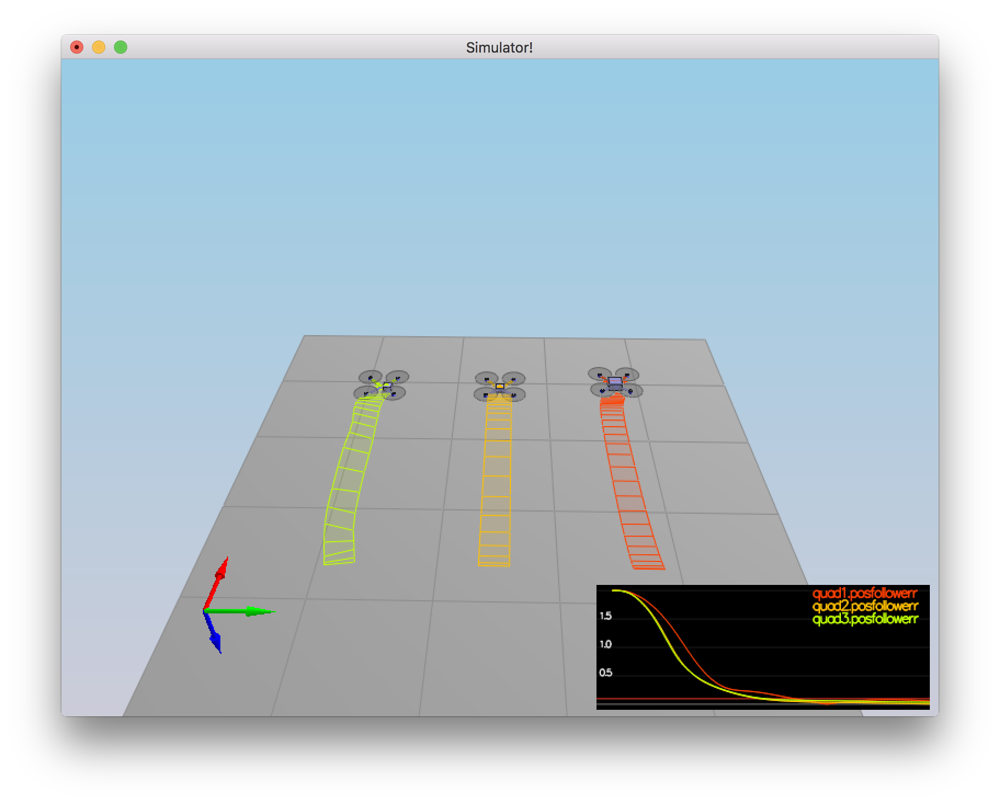
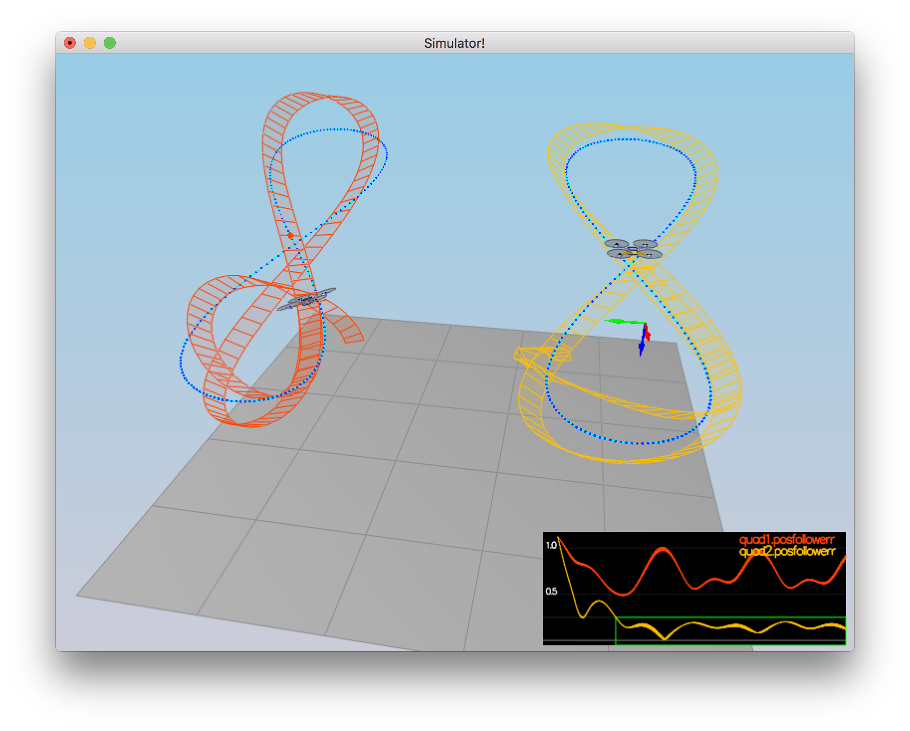

# 3-D Control of A Quadcopter #

## The Tasks ##

### Body rate and roll/pitch control (scenario 2) ###

For this simulation, the first task was to complete `GenerateMotorCommands()` method.

This method calculates the thrust required for each individual motors given the collective thrust and moment about the x, y and z axis.

To calculate individual thrust of motors, I used below equations to convert collective thrust and moment to individual thrust.

```
Thrust_Motor_1 = (F_total + F_x + F_y + F_z)/4
Thrust_Motor_2 = (F_total - F_x + F_y - F_z)/4
Thrust_Motor_3 = (F_total + F_x - F_y - F_z)/4
Thrust_Motor_4 = (F_total - F_x - F_y + F_z)/4
```

where F_Total is the collective thrust, F_x is the thrust generated by moment along x-axis and similarly for F_y, y-axis and F_z and z-axis. This code is located at line 75 in QuadControl.cpp file.


#### Implement body rate control
Next in order to stabilize the drone about its rotation axis, we needed to control moment and make it stable. The 'BodyRateControl()' method is used to stabilize the moments. It uses a P controller which has a tunable parameter, kpPQR. This code is located at line 125 in QuadControl.cpp file.

The P controller is implemented using the below equation:

```
Commanded_Moment = kpPQR * (pqrCommanded - pqrCurrent) * MOI
```

#### Implement roll / pitch control

The roll pitch controller is used to control the roll and pitch of drone about x and y axis, respectively.

The roll/pitch controller is also implemented using a P controller with code located at line 157 in QuadControl.cpp file.

The roll/pitch controller is stabilized by tuning the kpBank parameter of P controller.

The below figure shows the stabilized drone after implementing body rate controller and roll pitch controller.

<p align="center">

</p>


### Position/velocity and yaw angle control (scenario 3) ###

The position and velocity controller for x and y position is implemented by method `LateralPositionControl()`. This method uses a PD controller to control the acceleration of drone in 3 axis based on the desired position and velocity of the drone. This code is located at line 257 in QuadControl.cpp file.

The desired acceleration is constrained by the maximum and minimum acceleration supported by drone (due to max thrust of rotors).

The PD controller is tuned by tuning the kpPosXY for position and kpVelXY for velocity component.


The function `AltitudeControl()` uses a PID controller to control the vertical position and velocity of a drone and outputs a desired acceleration for drone to reach the desired location. The kpPosZ and kpVelZ parameters are tuned to get desired output. This code is located at line 203 in QuadControl.cpp file.


The function `YawControl()` controls the yaw component of drone. The function implements a P controller using the below equation:

```
Commanded_Yaw_Rate = kpYaw * (yawCommanded - yawCurrent)
```

This code is located at line 307 in QuadControl.cpp file.


The below figure shows the stabilized drone after implementing lateral position controller, altitude controller and yaw controller.

<p align="center">

</p>


### Non-idealities and robustness (scenario 4) ###

With this scenario and original code implemented for AltitudeControl where integral part was not used, the quad with error in its mass (red quad) and quad with its center of mass shifted (green quad) behaved different than normal. The red quad came crashing down as it was heavy and green quad flied off out of boundary and crashed due to abnormal rotation caused by its shifted center of mass. To account for all of these, I added the integral portion to the PD controller of AltitudeControl. This code is located at line 208, 212, 214 in QuadControl.cpp file.

To account for shifting of center of mass I tuned the roll, pitch and yaw parameters until the quad became stable enough and then tuned the integral part so that it remained level.


The below figure shows the stabilized drone after incorporating integral component in altitude controller.

<p align="center">

</p>

### Tracking trajectories (scenario 5) ###

To make the quads follow the trajectory I tuned the kpPQR, kpPosXY, kpVelXY and KiPosZ parameters. These parameters helped the drone to follow the given trajectory.

The below figure shows the yellow drone following its intended trajectory after stabilizing itself from initial position.

<p align="center">

</p>
